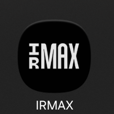
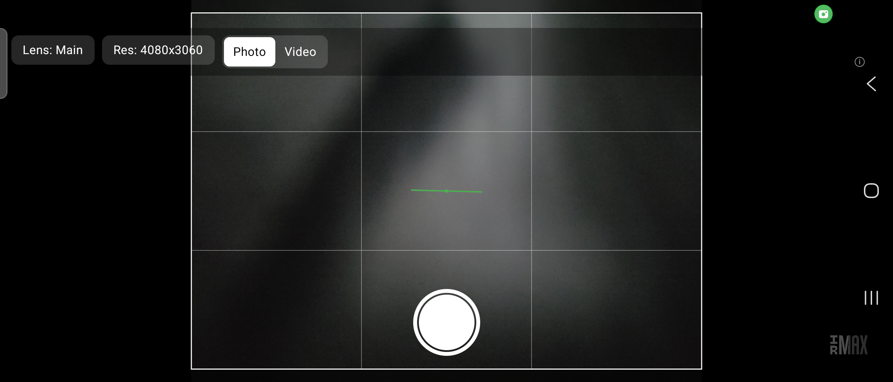
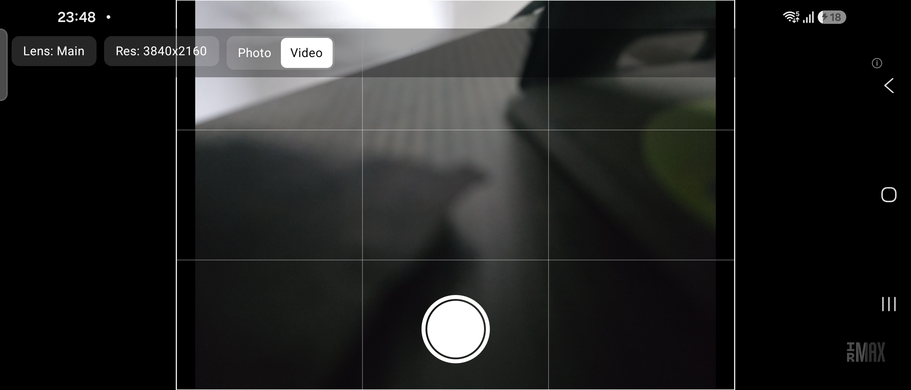
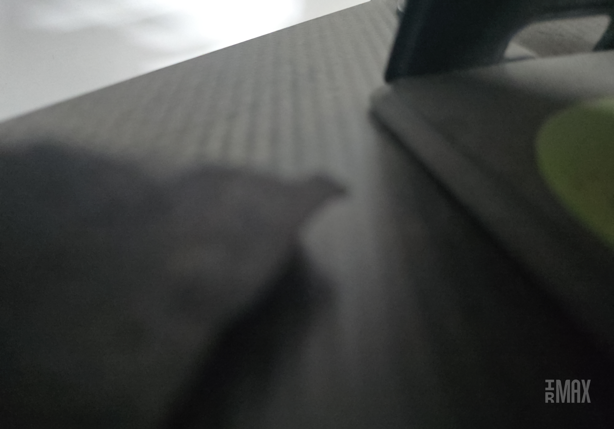
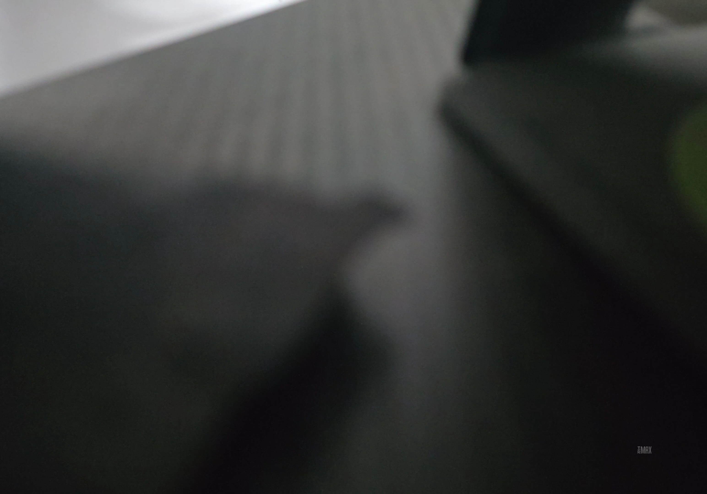

# IRMAX — IMAX 70mm Camera for Android

A native Android camera app, built for the Samsung Galaxy Z Fold7, that lets you **compose and shoot photo and video framed for the true 1.43:1 IMAX 70mm film ratio** — the classic full-frame 15/70 IMAX look, taller and wider than a standard phone photo or 16:9 video.

<p align="center">
  
</p>

## Why

Phone cameras only ever expose a handful of HAL-defined resolutions and aspect ratios (4:3, 16:9, 1:1...). None of them is 1.43:1, and there's no way to make a sensor natively output that ratio — every camera app on every phone hits this same wall. IRMAX solves it the only way that's actually possible:

1. **Discover** the real resolutions and lenses your phone's Camera2 HAL exposes (never hardcoded — Samsung sometimes gates its highest-resolution modes behind its own camera app, so what's actually reachable through the public API has to be measured, not assumed).
2. **Frame** live with a 1.43:1 guide overlay so you compose correctly in the viewfinder, at the highest resolution actually available.
3. **Crop** to an exact 1.43:1 deliverable immediately after capture — trimming top/bottom for a 4:3 source or left/right for a 16:9 source, whichever direction applies — and bake in a watermark.

This project is the shooting front-end to a companion desktop pipeline ([`convert_to_imax.sh`](../convert_to_imax.sh)) that masters footage into the full theatrical IMAX spec (7680×5372, HEVC 10-bit, BT.2020, 200 Mbps, EAC3, MKV). IRMAX doesn't duplicate that mastering step — it just captures clean, correctly-framed 1.43:1 input for it.

## Screenshots

| Photo mode | Video mode |
|---|---|
|  |  |

| Cropped photo output | Cropped video frame |
|---|---|
|  |  |

## Features

- **Live 1.43:1 framing guide** — dims everything outside the exact region that will survive the crop, computed generically from whichever resolution/ratio is actually selected (handles both "trim top/bottom" and "trim left/right" cases with the same math, so the guide and the real crop can never drift apart).
- **Rule-of-thirds grid** inside the guide box for composition alignment.
- **Bubble level** — a rotation-vector-sensor artificial horizon that turns green (with a haptic tick) when the phone is held level.
- **Lens picker** — every back-facing camera the device actually exposes (main, ultra-wide, etc.), labeled by focal length rank rather than hardcoded assumptions.
- **Resolution picker** — every still size and every video quality tier (480p up through whatever the device's HAL reports, e.g. 4K UHD) the *selected* lens supports, queried live via `CameraCharacteristics` and `CamcorderProfile`.
- **Photo capture** — shoots at the selected resolution, crops to 1.43:1, bakes in a bottom-right watermark at 10% frame width / 30% opacity, and publishes the result to the system Gallery (`Pictures/IRMAX`).
- **Video capture** — records at the selected resolution/quality, crops to 1.43:1 and applies the same watermark via Media3 Transformer (GPU-accelerated crop + overlay, no ffmpeg dependency), and publishes to Gallery (`Movies/IRMAX`).
- **Capabilities debug screen** — a plain-text dump of every size/quality the back camera(s) report, so you always know what "highest resolution" actually means on your specific unit.
- **Fold-aware** — handles fold/unfold transitions without tearing down the camera session or recreating the Activity mid-shot.

### A note on resolution

On the test unit (Galaxy Z Fold7 / SM-F966B), the public Camera2 API exposes a **12.5MP main lens capped at 4K UHD video** — no 8K, no 200MP mode. Samsung's own camera app can reach higher because it uses private vendor extensions that third-party apps can't call. IRMAX never assumes a number here: it queries the device at runtime and shows you exactly what's reachable, so this simply reflects what *this specific phone* exposes to third-party apps, not a limitation of the app itself.

## How the crop works

Given a captured frame of ratio `R` and the target `1.43:1`:

- If `R > 1.43` (e.g. 16:9 video, R≈1.78) — the source is *wider* than the target, so the crop trims **left and right**.
- If `R < 1.43` (e.g. 4:3 photo, R≈1.33) — the source is *narrower* than the target, so the crop trims **top and bottom**.

This single rule ([`ImaxCrop.kt`](app/src/main/kotlin/com/ramesh/imaxcam/ImaxCrop.kt)) drives the live framing overlay, the photo crop, and the video crop identically, so what you see in the viewfinder is exactly what you get.

## Tech stack

- **Kotlin** + **Jetpack Compose** (single-Activity, no navigation library — a handful of screens swapped by local state)
- **CameraX** with Camera2 interop for lens selection, resolution pinning, and capability probing
- **Media3 Transformer** for video crop + watermark overlay (GPU-accelerated, no ffmpeg/native binaries)
- No DI framework, no multi-module Gradle — scoped for a solo/hobbyist project, not enterprise architecture

Minimum SDK 31, target/compile SDK 35.

## Project structure

```
app/src/main/kotlin/com/ramesh/imaxcam/
  MainActivity.kt          — permission flow, top-level screen switch
  CaptureScreen.kt         — viewfinder screen: preview, overlays, shutter/record button
  CameraEngine.kt          — CameraX use-case binding (photo & video paths)
  CameraCapabilities.kt    — runtime probing of lenses/resolutions/video qualities
  CaptureControls.kt       — lens/resolution/mode option-building helpers
  ControlsBar.kt           — top control bar UI (lens/res dropdowns, mode toggle)
  FramingOverlay.kt        — live 1.43:1 guide box + rule-of-thirds grid
  LevelIndicator.kt        — bubble level (rotation-vector sensor) + haptic feedback
  ImaxCrop.kt              — the shared crop-rect math used everywhere
  PhotoCropper.kt          — JPEG crop + watermark bake-in
  VideoCropper.kt          — Media3 Transformer crop + watermark bake-in
  CaptureActions.kt        — takePhoto / startVideoRecording orchestration
  GalleryPublisher.kt      — publishes finished files to MediaStore
  CapabilitiesScreen.kt    — debug screen dumping every detected size/quality
```

## Building & running

Requires Android Studio / an Android SDK with platform 35, and a device running Android 12 (API 31) or newer.

```bash
./gradlew installDebug   # builds and installs onto a connected device via adb
```

The first launch asks for camera + microphone permission (audio is needed for video recording). Captured files land in the app's private storage under `IMAXCam/` (both the untouched `_RAW` capture and the cropped `_143crop` deliverable), and the cropped versions are also published to the system Gallery.

## Status

Photo and video capture, cropping, watermarking, and Gallery publishing are all working end-to-end on-device. Still open: an in-app export/share screen and a documented end-to-end run through the companion `convert_to_imax.sh` desktop mastering script.
